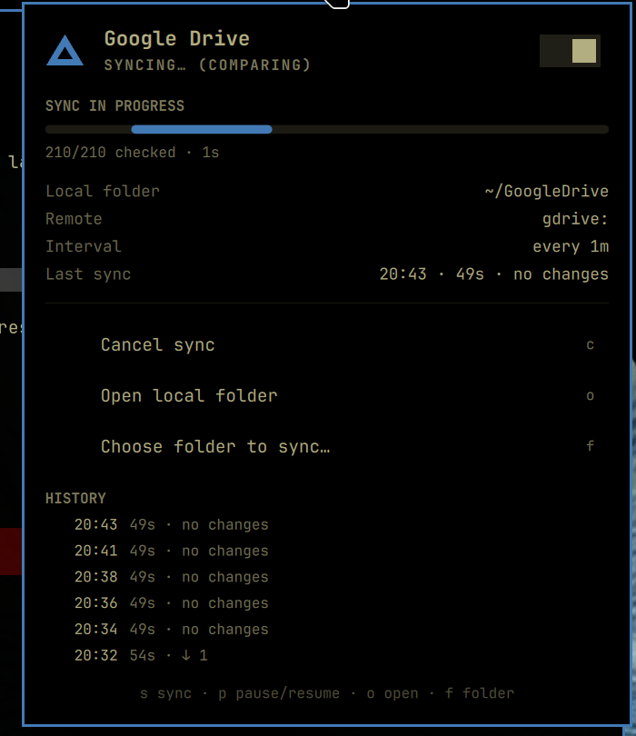

# Google Drive for Omarchy

*[Version française](README.fr.md)*

An [Omarchy](https://omarchy.org) shell plugin that replaces "Google Drive for desktop" on Linux:
two-way sync between Google Drive and a local folder with `rclone bisync`, a status icon in the bar,
live progress, visible problems, and a folder picker.



## Features

- **Bar indicator**: Drive triangle icon — red with a dot when something needs attention, pulsing while
  a sync runs, dimmed when paused. Left click opens the panel, right click syncs now, middle click opens the folder.
- **Live progress**: progress bar, bytes / files / checks, speed, ETA, files currently transferring
  (read from the `rclone rc` API), and the list of files processed so far.
- **Visible problems**: a banner for the actionable states (resync required, remote not configured,
  folder missing, last run failed) with a one-click fix, plus "Problems" and "Warnings" sections.
  A desktop notification fires when a sync goes from OK to failed (and back).
- **Folder picker**: browse and choose the local folder from the panel (`f`), or type a path.
- **Pause / resume** switch, run history, keyboard shortcuts (`s` sync, `p` pause/resume, `o` open folder,
  `f` choose folder, `r` resync when required, `c` cancel a running sync, `Esc` close).

## Prerequisites

Omarchy ships everything the plugin needs except **rclone**, which you must install and configure yourself
(the plugin installer never installs packages or runs scripts):

```bash
omarchy pkg add rclone
rclone config          # create a remote of type "drive", e.g. named "gdrive"
```

### Create your own Google client ID (required)

rclone's shared Google Drive `client_id` is being retired in 2026 and is heavily rate-limited, so the
remote must use your own OAuth client. It takes about five minutes and does not require a paid account.

1. Open the [Google Cloud Console](https://console.cloud.google.com/) with the Google account that owns
   the Drive, and create a project (e.g. `rclone`) via the project selector at the top.
2. **APIs & Services → Library**: search for **Google Drive API** and click **Enable**.
3. **APIs & Services → OAuth consent screen** (also called *Google Auth Platform → Branding/Audience*):
   - App name: `rclone`, user support email and developer contact: your address.
   - Audience: **External**.
   - Under **Audience → Test users**, add your own Gmail address. While the app stays in *Testing*
     mode, only test users can authorize it — that is all you need for personal use.
   - Optional: click **Publish app** to leave *Testing* mode. Otherwise Google expires the refresh
     token after 7 days and rclone will ask you to reconnect weekly. Publishing a personal app does not
     require verification as long as you only request the Drive scope for yourself.
4. **APIs & Services → Credentials → Create credentials → OAuth client ID**:
   application type **Desktop app**, any name. Copy the **Client ID** and **Client secret**
   (or download the JSON — the values are under `installed.client_id` / `installed.client_secret`).
5. Attach them to the remote and re-authorize (a browser window opens; accept the
   "Google hasn't verified this app" warning with *Continue*, since it is your own app):

   ```bash
   rclone config update gdrive client_id "YOUR_ID.apps.googleusercontent.com" client_secret "YOUR_SECRET"
   rclone config reconnect gdrive:
   rclone lsd gdrive:          # should list your top-level folders
   ```

If you create the remote from scratch with `rclone config`, paste the same client ID and secret when it
asks for them. No resync is needed after changing the client ID — only the token changes.

See also [rclone.org/drive — Making your own client_id](https://rclone.org/drive/#making-your-own-client-id).

## Install

```bash
omarchy plugin add https://github.com/enricojl/omarchy-gdrive-sync.git --enable
```

Enabling the plugin creates and starts the `systemd --user` units (`gdrive-sync.timer` / `gdrive-sync.service`).
The first run requires a *resync* (a `rclone bisync` requirement): the panel shows a banner with a
"Resync now" button. Resync copies files that exist on only one side to the other side
(nothing is deleted) and lets the newer file win when both differ (`--resync-mode newer`).

Update with `omarchy plugin update com.github.enricojl.gdrive-sync`; remove with
`omarchy plugin remove com.github.enricojl.gdrive-sync` (then optionally
`python3 ~/.config/omarchy/plugins/com.github.enricojl.gdrive-sync/gdrive-sync.py uninstall` beforehand
to drop the systemd units).

## Settings

Set from the panel (folder picker) or with `omarchy bar set com.github.enricojl.gdrive-sync <key> <value>`:

| Key | Default | Description |
|---|---|---|
| `remote` | `gdrive:` | rclone remote (`gdrive:` or `gdrive:SubFolder`) |
| `localDir` | `~/GoogleDrive` | Local folder to sync |
| `intervalSec` | `300` | Seconds between Drive checks, measured after the previous run ends (30–3600). This is how long a change made on another device takes to show up. |
| `watchLocal` | `true` | Watch the local folder with inotify and sync a few seconds after you change something (`omarchy bar set … watchLocal false --json` to disable) |
| `refreshIntervalSec` | `15` | Status refresh interval while idle |

Extra rclone flags live in `~/.config/gdrive-sync/config.json` under `extraArgs`
(default `["--drive-skip-gdocs"]`; add `"--copy-links"` to follow symlinks, for example).

## How it works

| File | Role |
|---|---|
| `manifest.json` | Plugin declaration (bar widget, settings schema) |
| `Panel.qml` | Bar icon + popup panel |
| `Service.qml` | Shared state: runs `gdrive-sync.py`, polls, applies settings |
| `Model.js` | Status parsing and formatting |
| `DriveIcon.qml` | Drive triangle icon with status dot |
| `gdrive-sync.py` | `rclone bisync` runner (called by systemd) **and** status/control CLI used by the panel |

- Each run executes `rclone bisync <remote> <folder> --rc --use-json-log --recover --resilient …`,
  logs to `~/.local/state/gdrive-sync/logs/run-*.log` (last 12 kept), then writes `last-run.json`
  and appends to `history.jsonl`.
- While a run is active, the panel reads live stats from `rclone rc` on `127.0.0.1:5573`.
- With `watchLocal` on, `gdrive-sync-watch.service` runs `inotifywait -m -r` on the local folder and
  starts a sync after 5 s of quiet (30 s at most). Events caused by the sync itself are ignored, as are
  hidden entries (`.obsidian/…`, `.git/…`) and temporary files — those still sync on the timer. There is
  no equivalent push signal from Google Drive, so remote changes are picked up by the timer only.
- The widget settings in `shell.json` are the source of truth; the service mirrors them to
  `~/.config/gdrive-sync/config.json` for the systemd runner.

CLI: `python3 gdrive-sync.py <status|sync-now|resync|cancel|pause|resume|install|uninstall|watch|dirs [path]|set-folder <path>>`.
IPC: `omarchy-shell com.github.enricojl.gdrive-sync <toggle|syncNow|resync|pause|resume|status>`.

## Development

Clone into `~/.config/omarchy/plugins/com.github.enricojl.gdrive-sync/` (the shell hot-reloads on save)
and validate with `omarchy plugin validate <dir>`. Shell logs: `journalctl --user -f | grep -i -E 'gdrive|qml'`.

## License

MIT
